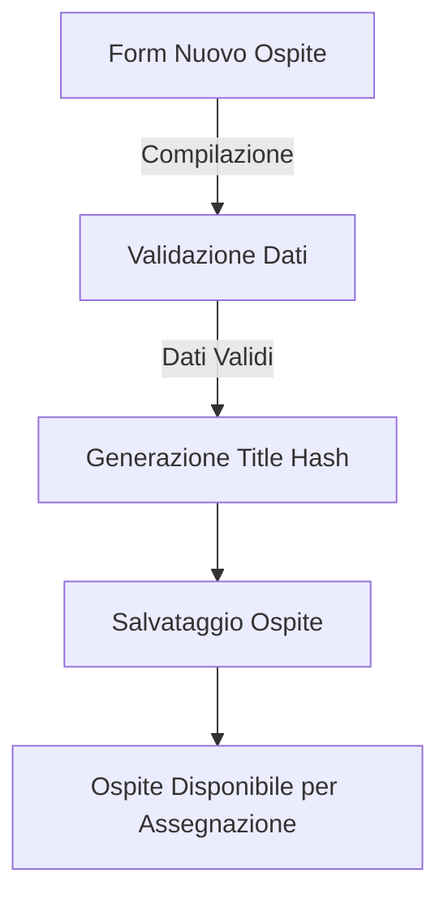
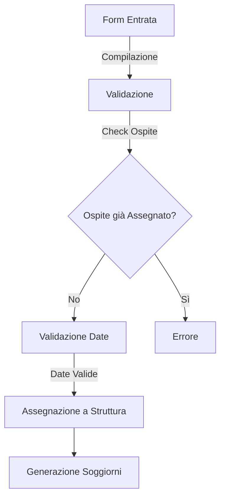
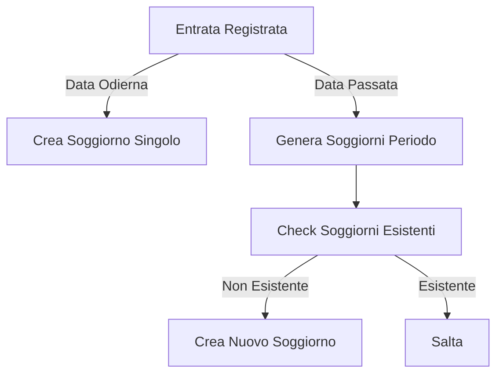

# Fokos Module

## Panoramica
Modulo custom per la gestione di ospiti, strutture e soggiorni in Drupal 11.
Gestisce il flusso di entrata/uscita degli ospiti nelle strutture e la generazione automatica dei soggiorni.

## Struttura del Modulo

```
   fokos/
   ├── src/
   │ ├── Service/
   │ │ ├── EntrateUsciteService.php # Gestione entrate/uscite
   │ │ ├── OspitiService.php # Gestione ospiti
   │ │ └── SoggiornoService.php # Gestione soggiorni
   │ └── Dto/
   │ ├── EntrataUscitaDto.php # DTO per entrate/uscite
   │ ├── OspiteDto.php # DTO per ospiti
   │ ├── SoggiornoDto.php # DTO per soggiorni
   │ └── StrutturaDto.php # DTO per strutture
   ├── fokos.info.yml # Informazioni del modulo
   ├── fokos.module # Hooks del modulo
   └── fokos.services.yml # Definizioni dei servizi
```

## Entità e Campi

### Ospite
| Campo                 | Tipo      | Obbligatorio | Note |
|----------------------|-----------|--------------|------|
| field_osp_nome       | string    | ✓            | Nome dell'ospite |
| field_osp_cognome    | string    | ✓            | Cognome dell'ospite |
| field_osp_cf         | string    |              | Codice fiscale |
| field_osp_data_nascita| datetime |              | Data di nascita |

### Entrate/Uscite
| Campo               | Tipo            | Obbligatorio | Note |
|--------------------|-----------------|--------------|------|
| field_eo_data_in   | datetime        | ✓            | Data di entrata |
| field_eo_data_out  | datetime        |              | Data di uscita |
| field_ref_ospite   | entity_reference|              | Riferimento all'ospite |
| field_ref_struttura| entity_reference|              | Riferimento alla struttura |
| field_ref_tariffa  | entity_reference|              | Riferimento alla tariffa |

### Soggiorno
| Campo                  | Tipo            | Obbligatorio | Note |
|-----------------------|-----------------|--------------|------|
| field_ref_entrata_uscita| entity_reference|              | Riferimento all'entrata/uscita |
| field_ref_ospite      | entity_reference|              | Riferimento all'ospite |
| field_ref_struttura   | entity_reference|              | Riferimento alla struttura |
| field_sog_data        | datetime        |              | Data del soggiorno |
| field_sog_tariffa     | decimal         |              | Importo della tariffa |

### Struttura
| Campo            | Tipo            | Obbligatorio | Note |
|-----------------|-----------------|--------------|------|
| field_refs_ospite| entity_reference| -1           | Lista degli ospiti assegnati |

### Termine della tassonomia: Tariffe
| Campo                | Tipo            | Obbligatorio | Note |
|---------------------|-----------------|--------------|------|
| field_ref_struttura | entity_reference| ✓            | Riferimento alla struttura |
| field_tariffa_importo| decimal         |              | Importo della tariffa |

## Flussi Principali

### 1. Registrazione Nuovo Ospite


### 2. Entrata Ospite in Struttura


### 3. Gestione Soggiorni


## Regole di Business

1. **Ospiti**
   - Un ospite può essere assegnato a una sola struttura
   - Il titolo dell'ospite è un hash generato automaticamente
   - Nome e cognome sono obbligatori

2. **Entrate/Uscite**
   - La data di entrata non può essere futura
   - La data di uscita deve essere successiva alla data di entrata
   - I riferimenti struttura e ospite non sono modificabili dopo la creazione

3. **Soggiorni**
   - Vengono generati automaticamente
   - Uno per ogni giorno di permanenza
   - La tariffa viene copiata dal termine di tassonomia

## Services

### OspitiService
Gestisce la registrazione e l'assegnazione degli ospiti.
- Generazione titoli univoci per gli ospiti
- Verifica e gestione delle assegnazioni alle strutture
- Modifiche ai form degli ospiti

### EntrateUsciteService
Gestisce il flusso di entrata/uscita degli ospiti nelle strutture.
- Validazione dei form di entrata/uscita
- Processamento delle nuove entrate
- Gestione delle date di entrata e uscita
- Coordinamento con i servizi di ospiti e soggiorni

### SoggiornoService
Gestisce la creazione e sincronizzazione dei soggiorni.
- Creazione dei soggiorni giornalieri
- Generazione automatica dei soggiorni per periodi
- Sincronizzazione dei soggiorni con le entrate/uscite
- Eliminazione dei soggiorni non più validi

## Note per lo Sviluppo

### Aggiornamento della Documentazione
1. Aggiornare i commenti PHPDoc nei file sorgente
2. Aggiornare questo README.md per:
   - Nuove entità o campi
   - Modifiche ai flussi principali
   - Nuove regole di business
   - Cambiamenti nell'architettura

### Testing
- Verificare la validazione delle date
- Testare la generazione automatica dei soggiorni
- Controllare l'unicità delle assegnazioni ospiti


### TODO

``` 
   /**
   * Aggiorna i riferimenti mancanti nei soggiorni.
   */
   public function aggiornaSoggiorniSenzaRiferimento(NodeInterface $entrata_uscita): void {
      $query = $this->entityTypeManager->getStorage('node')->getQuery()
         ->condition('type', 'soggiorno')
         ->condition('field_ref_ospite', $entrata_uscita->get('field_ref_ospite')->target_id)
         ->condition('field_ref_struttura', $entrata_uscita->get('field_ref_struttura')->target_id)
         ->condition('field_ref_entrata_uscita', NULL, 'IS NULL')
         ->accessCheck(FALSE);
      
      $soggiorni_ids = $query->execute();
      if (!empty($soggiorni_ids)) {
         $soggiorni = $this->entityTypeManager->getStorage('node')->loadMultiple($soggiorni_ids);
         foreach ($soggiorni as $soggiorno) {
               $soggiorno->set('field_ref_entrata_uscita', $entrata_uscita);
               $soggiorno->save();
         }
      }
   }
```