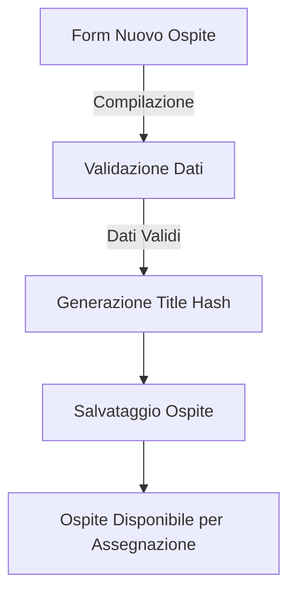
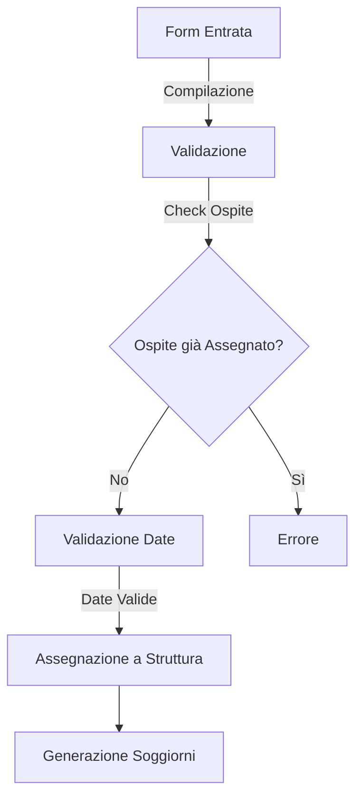
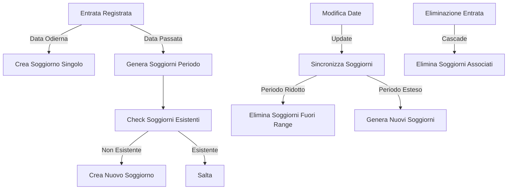
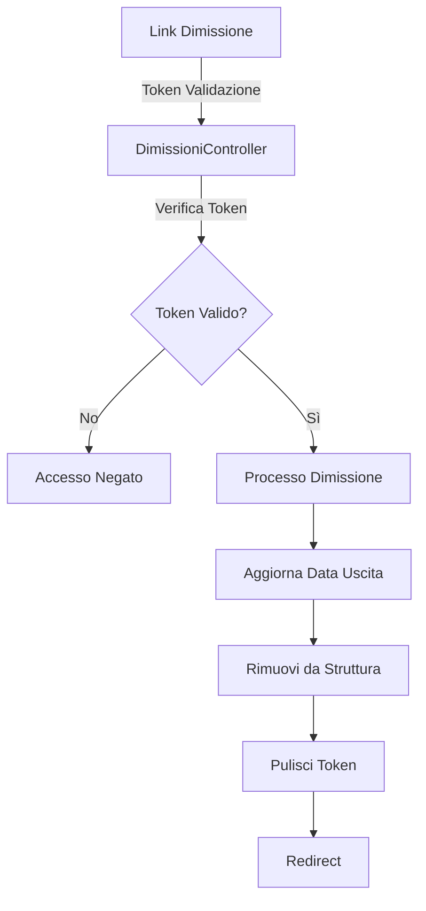
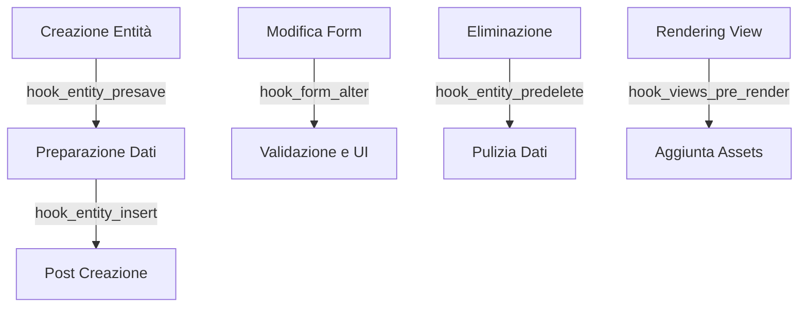

# Fokos Module

## Panoramica
Modulo custom per la gestione di ospiti, strutture e soggiorni in Drupal 11.
Gestisce il flusso di entrata/uscita degli ospiti nelle strutture e la generazione automatica dei soggiorni.

## Struttura del Modulo

```
   fokos/
   ├── src/
   │ ├── Controller/
   │ │ └── DimissioniController.php # Gestione dimissioni ospiti
   │ ├── Service/
   │ │ ├── EntrateUsciteService.php # Gestione entrate/uscite
   │ │ ├── OspitiService.php # Gestione ospiti
   │ │ └── SoggiornoService.php # Gestione soggiorni
   │ └── Dto/ # [In Sviluppo]
   │ ├── EntrataUscitaDto.php # DTO per entrate/uscite
   │ ├── OspiteDto.php # DTO per ospiti
   │ ├── SoggiornoDto.php # DTO per soggiorni
   │ └── StrutturaDto.php # DTO per strutture
   ├── js/
   │ └── dimissioni.js # Gestione frontend dimissioni
   ├── fokos.info.yml # Definizione modulo
   ├── fokos.libraries.yml # Definizione librerie
   ├── fokos.module # Implementazione hooks
   ├── fokos.routing.yml # Configurazione routing
   ├── fokos.services.yml # Definizione servizi
   └── README.md # Documentazione
```

## Entità e Campi

### Ospite
| Campo                   | Tipo      | Obbligatorio | Note |
|------------------------|-----------|--------------|------|
| field_osp_nome         | string    | ✓            | Nome dell'ospite |
| field_osp_cognome      | string    | ✓            | Cognome dell'ospite |
| field_osp_cf           | string    |              | Codice fiscale |
| field_osp_data_nascita | datetime  |              | Data di nascita |
| field_token_dimissioni | string    |              | Token univoco per la dimissione |

### Entrate/Uscite
| Campo                | Tipo            | Obbligatorio | Note |
|---------------------|-----------------|--------------|------|
| field_eo_data_in    | datetime        | ✓            | Data di entrata |
| field_eo_data_out   | datetime        |              | Data di uscita |
| field_ref_ospite    | entity_reference|              | Riferimento all'ospite |
| field_ref_struttura | entity_reference|              | Riferimento alla struttura |
| field_ref_tariffa   | entity_reference|              | Riferimento alla tariffa |

### Soggiorno
| Campo                   | Tipo            | Obbligatorio | Note |
|------------------------|-----------------|--------------|------|
| field_ref_entrata_uscita| entity_reference|              | Riferimento all'entrata/uscita |
| field_ref_ospite       | entity_reference|              | Riferimento all'ospite |
| field_ref_struttura    | entity_reference|              | Riferimento alla struttura |
| field_sog_data         | datetime        |              | Data del soggiorno |
| field_sog_tariffa      | decimal         |              | Importo della tariffa |

### Struttura
| Campo             | Tipo            | Obbligatorio | Note |
|------------------|-----------------|--------------|------|
| field_refs_ospite| entity_reference| -1           | Lista degli ospiti assegnati |

### Termine della tassonomia: Tariffe
| Campo                 | Tipo            | Obbligatorio | Note |
|----------------------|-----------------|--------------|------|
| field_ref_struttura  | entity_reference| ✓            | Riferimento alla struttura |
| field_tariffa_importo| decimal         |              | Importo della tariffa |

## Flussi Principali

### 1. Registrazione Nuovo Ospite


### 2. Entrata Ospite in Struttura


### 3. Gestione Soggiorni


### 4. Gestione Dimissioni


## Regole di Business

1. **Ospiti**
   - Un ospite può essere assegnato a una sola struttura
   - Il titolo dell'ospite è un hash generato automaticamente
   - Nome e cognome sono obbligatori

2. **Entrate/Uscite**
   - La data di entrata non può essere futura
   - La data di uscita deve essere successiva alla data di entrata
   - I riferimenti struttura e ospite non sono modificabili dopo la creazione

3. **Soggiorni**
   - Vengono generati automaticamente in due modi:
     * Creazione singola per entrate del giorno corrente
     * Generazione multipla per entrate con date passate
   - La sincronizzazione avviene automaticamente quando:
     * Vengono modificate le date di entrata/uscita
     * Viene eliminata un'entrata/uscita (eliminazione a cascata)
   - Il titolo del soggiorno segue il formato: "Soggiorno OSP[id] STR[id] [data]"
   - La tariffa viene copiata dal termine di tassonomia associato all'entrata/uscita
   - I soggiorni mantengono riferimenti a:
     * Entrata/uscita di origine
     * Ospite
     * Struttura

## Services

### OspitiService
Gestisce la registrazione e l'assegnazione degli ospiti.
- **Funzionalità principali**:
  - Generazione titoli univoci per gli ospiti (hash SHA-256)
  - Verifica e gestione delle assegnazioni alle strutture
  - Modifiche ai form degli ospiti (nascondere campo titolo)
  - Gestione token di dimissione:
    * Generazione token univoco all'assegnazione
    * Pulizia token dopo la dimissione
- **Validazioni**:
  - Verifica che un ospite non sia già assegnato ad altra struttura
  - Controllo validità struttura prima dell'assegnazione

### EntrateUsciteService
Gestisce il flusso di entrata/uscita degli ospiti nelle strutture.
- **Gestione Form**:
  - Validazione dei form di entrata/uscita
  - Disabilitazione campi struttura e ospite in modalità modifica
- **Validazioni Date**:
  - La data di entrata non può essere futura
  - La data di uscita deve essere successiva alla data di entrata
  - Gestione errori durante la validazione delle date
- **Processamento**:
  - Coordinamento con OspitiService per l'assegnazione
  - Generazione automatica dei titoli (formato: "Entrata/Uscita OSP[id] STR[id] [data]")
  - Logging delle operazioni

### SoggiornoService
Gestisce la creazione e sincronizzazione dei soggiorni.
- **Creazione Soggiorni**:
  - Creazione singola per entrate del giorno corrente
  - Generazione automatica per periodi passati
  - Applicazione automatica delle tariffe dai termini di tassonomia
- **Sincronizzazione**:
  - Gestione modifiche date entrata/uscita:
    * Eliminazione soggiorni fuori dal nuovo intervallo
    * Generazione soggiorni per nuovi periodi
    * Mantenimento soggiorni esistenti validi
  - Gestione eliminazione entrate/uscite:
    * Eliminazione a cascata dei soggiorni associati
    * Logging delle operazioni di eliminazione
- **Gestione Form**:
  - Nascondere campo titolo nei form soggiorno
  - Gestione automatica dei riferimenti

## Hooks Implementati

### Hooks Principali
1. **hook_entity_presave**
   - Gestisce la creazione di nuovi nodi:
     * Per ospiti: generazione titolo hash
     * Per entrate/uscite: processamento nuova entrata
   - Gestisce l'aggiornamento di entrate/uscite esistenti:
     * Sincronizzazione automatica dei soggiorni

2. **hook_entity_insert**
   - Gestisce la creazione dei soggiorni per nuove entrate/uscite:
     * Per data odierna: crea soggiorno singolo
     * Per date passate: genera tutti i soggiorni necessari

3. **hook_entity_predelete**
   - Gestisce l'eliminazione delle entrate/uscite:
     * Eliminazione a cascata dei soggiorni associati
     * Logging del numero di soggiorni eliminati

4. **hook_form_alter**
   - Modifica i form per:
     * ospiti
     * entrate/uscite
     * soggiorni
   - Funzionalità comuni:
     * Nasconde il campo titolo
     * Applica validazioni specifiche per tipo
     * Gestisce l'accesso ai campi in modalità modifica

5. **hook_theme_suggestions_page_title_alter**
   - Aggiunge suggerimenti per il tema del titolo della pagina
   - Personalizza la visualizzazione in base al tipo di nodo

6. **hook_views_pre_render**
   - Aggiunge la libreria 'dimissioni' ai blocchi view specifici
   - Gestisce l'integrazione JavaScript per le funzionalità di dimissione

### Gestione Eventi


## Librerie e Asset

### JavaScript
Il modulo include le seguenti librerie JavaScript:

#### dimissioni.js
- **Dipendenze**: 
  - core/drupal
  - core/drupalSettings
  - core/once
- **Scopo**: Gestione delle interazioni lato client per le dimissioni degli ospiti

### File di Configurazione

#### fokos.routing.yml
```yaml
fokos.dimetti_ospite:
  path: '/admin/fokos/dimetti-ospite/{ospite_id}/{struttura_id}/{token}'
  defaults:
    _controller: '\Drupal\fokos\Controller\DimissioniController::dimettiOspite'
  requirements:
    _permission: 'access content'
```

#### fokos.services.yml
Definisce i seguenti servizi:
- `fokos.ospiti_service`: Gestione degli ospiti
- `fokos.soggiorno_service`: Gestione dei soggiorni
- `fokos.entrate_uscite_service`: Gestione delle entrate/uscite con relative dipendenze

#### fokos.libraries.yml
Definisce le librerie JavaScript e CSS utilizzate dal modulo, con le relative dipendenze.

## Requisiti e Dipendenze
- **Core**: Drupal ^10 || ^11
- **Moduli Core Richiesti**:
  - node
  - views
  - datetime
  - taxonomy
- **Librerie JavaScript**:
  - core/drupal
  - core/drupalSettings
  - core/once

### Note sulla Compatibilità
- Sviluppato e testato su Drupal 10
- Compatibile con Drupal 11
- Richiede PHP 8.1 o superiore

### Permessi e Sicurezza
- Accesso alle funzionalità di dimissione: `access content`
- Validazione token per operazioni di dimissione
- Protezione CSRF sui form
- Validazione input su tutte le operazioni